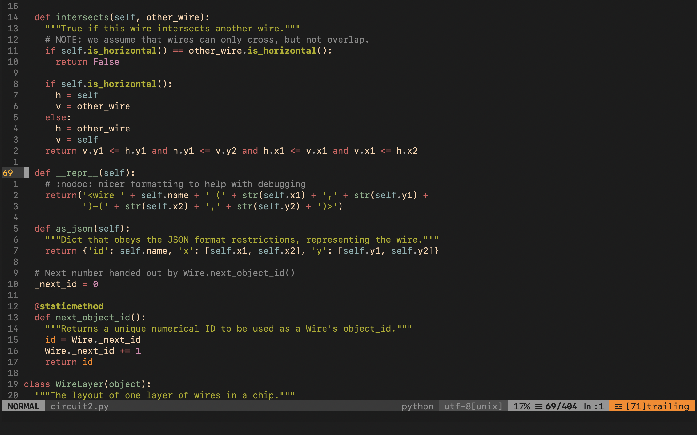
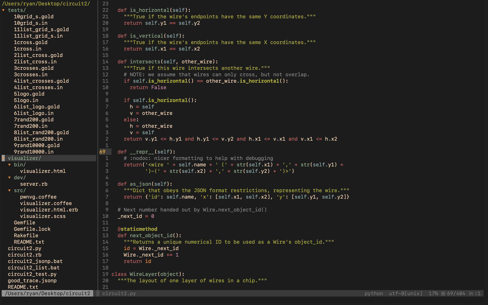

# Neovim Config

In progress, please contact me with any questions

All keybinds are default, with the exeption of some added ones.

  

  

| Shortcut          | Mode   | Description                                               |
|-------------------|--------|-----------------------------------------------------------|
| `#`               | Visual | Highlights blocks of text in python                       |
| `-#`              | Visual | Removes highlightes blocks of text in python              |

